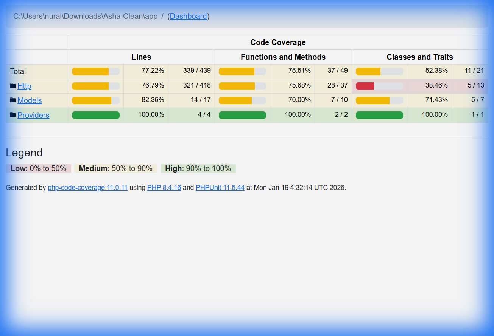
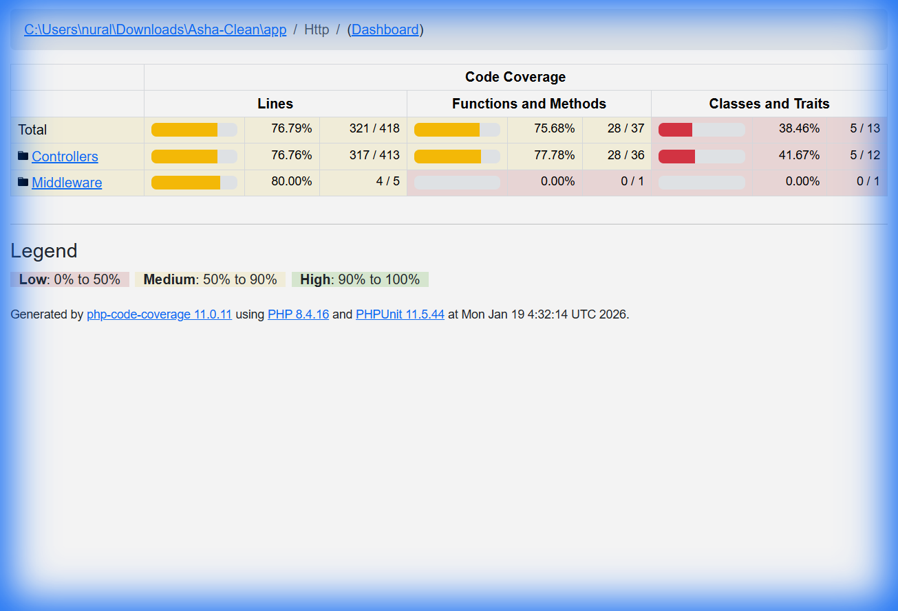
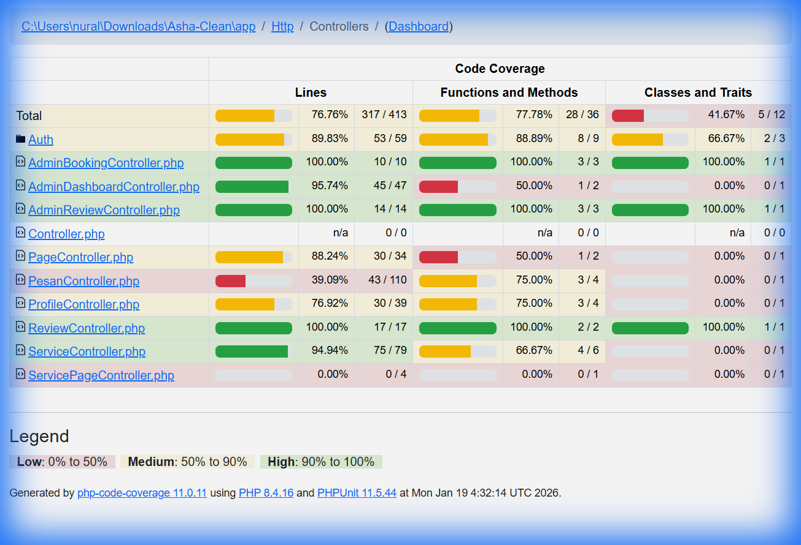
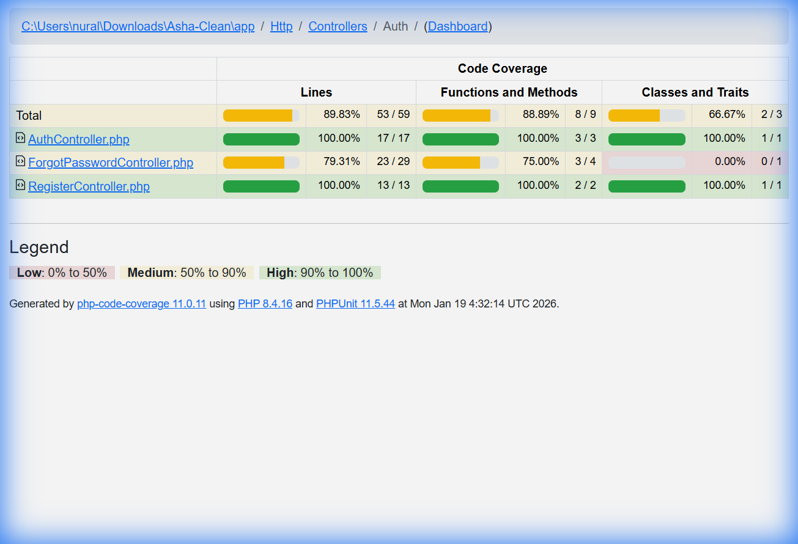
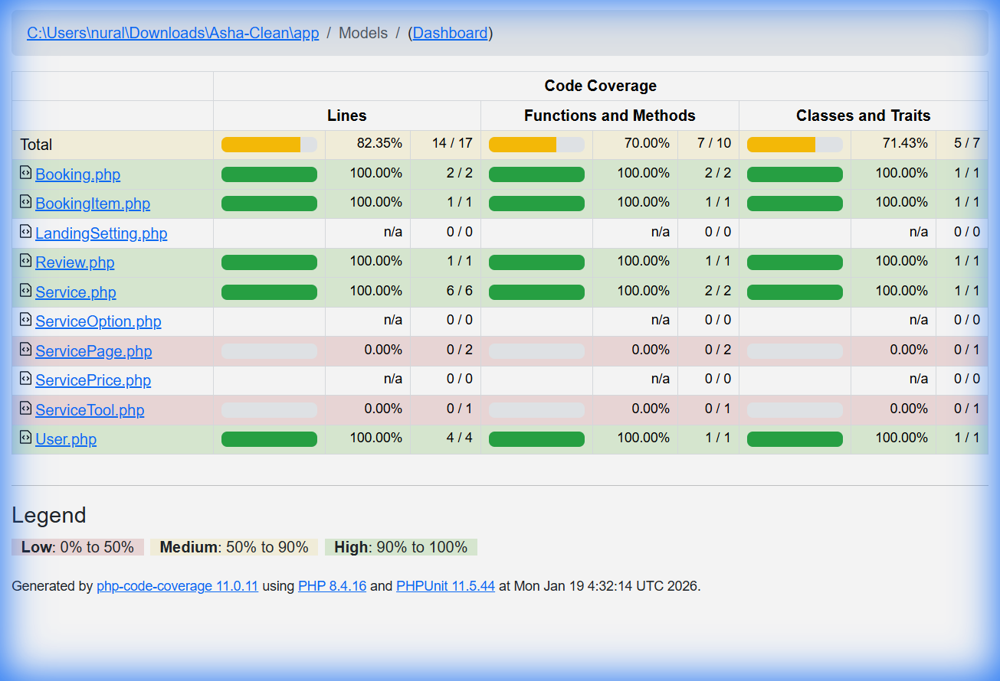

# Laporan Analisis Code Coverage - Asha-Clean

**Tanggal Generasi:** 19 Januari 2026  
**Versi PHP:** 8.4.16  
**PHPUnit:** 11.5.44

---

## 1. Ringkasan Eksekutif

Laporan ini menyajikan analisis code coverage aplikasi **Asha-Clean** berdasarkan hasil pengujian otomatis dengan PHPUnit dan Xdebug.

### Statistik Keseluruhan

| Metrik | Nilai | Status |
|--------|-------|--------|
| **Lines** | 77.22% (339/439) | ⚠️ Medium |
| **Functions & Methods** | 75.51% (37/49) | ⚠️ Medium |
| **Classes & Traits** | 52.38% (11/21) | 🔴 Low |

---

## 2. Kategori Http (Controllers & Middleware)

Kategori Http mencakup seluruh logika bisnis utama aplikasi, termasuk controllers dan middleware.

### 2.1 Ringkasan Http

| Metrik | Nilai | Status |
|--------|-------|--------|
| **Lines** | 76.79% (321/418) | ⚠️ Medium |
| **Methods** | 75.68% (28/37) | ⚠️ Medium |
| **Classes** | 38.46% (5/13) | 🔴 Low |

---

### 2.2 Detail Controllers

Controllers adalah komponen utama yang menangani request HTTP dari pengguna. Berikut adalah rincian coverage per controller:

#### Tabel Coverage Controllers

| Controller | Lines | Methods | Status |
|------------|-------|---------|--------|
| **AdminBookingController.php** | 100.00% (10/10) | 100.00% (3/3) | ✅ Excellent |
| **AdminReviewController.php** | 100.00% (14/14) | 100.00% (3/3) | ✅ Excellent |
| **ReviewController.php** | 100.00% (17/17) | 100.00% (2/2) | ✅ Excellent |
| **AdminDashboardController.php** | 95.74% (45/47) | 50.00% (1/2) | ✅ High |
| **ServiceController.php** | 94.94% (75/79) | 66.67% (4/6) | ✅ High |
| **Auth (Folder)** | 89.83% (53/59) | 88.89% (8/9) | ✅ High |
| **PageController.php** | 88.24% (30/34) | 50.00% (1/2) | ✅ High |
| **ProfileController.php** | 76.92% (30/39) | 75.00% (3/4) | ⚠️ Medium |
| **PesanController.php** | 39.09% (43/110) | 75.00% (3/4) | 🔴 Low |
| **ServicePageController.php** | 0.00% (0/4) | 0.00% (0/1) | 🔴 Not Tested |

#### Analisis per Controller

**Controllers dengan Coverage Excellent (100%):**
- `AdminBookingController`: Seluruh fitur manajemen booking admin tercover sepenuhnya
- `AdminReviewController`: Fitur moderasi ulasan telah teruji lengkap
- `ReviewController`: Fitur submit dan tampilan review pengguna ter-cover penuh

**Controllers dengan Coverage High (85-99%):**
- `ServiceController`: Hampir seluruh operasi CRUD layanan ter-cover. Sedikit area belum tertest pada method `store()` dan `update()` dengan file upload
- `AdminDashboardController`: Dashboard admin dan settings ter-cover dengan baik

**Controllers dengan Coverage Low (<70%):**
- `PesanController`: Hanya 39.09% karena method `submit()` menggunakan integrasi Midtrans dengan static methods yang sulit di-mock
- `ServicePageController`: Belum memiliki test sama sekali

---

### 2.3 Auth Controllers

Controllers authentication menangani proses login, register, dan password reset.

| Controller | Lines | Methods | Status |
|------------|-------|---------|--------|
| **AuthController.php** | 100.00% (17/17) | 100.00% (3/3) | ✅ Excellent |
| **RegisterController.php** | 100.00% (13/13) | 100.00% (2/2) | ✅ Excellent |
| **ForgotPasswordController.php** | 79.31% (23/29) | 75.00% (3/4) | ⚠️ Medium |

**Analisis:**
- Login dan registrasi ter-cover 100%
- Password reset memiliki gap pada method `showResetForm()` yang belum teruji

---

### 2.4 Middleware

| Middleware | Lines | Methods | Status |
|------------|-------|---------|--------|
| **RoleMiddleware.php** | 80.00% (4/5) | 0.00% (0/1) | ⚠️ Medium |

**Catatan:** Meskipun lines coverage mencapai 80%, method coverage 0% karena tidak melewati entry point `handle()` yang terdaftar.

---

## 3. Kategori Models

Models mewakili struktur data dan relationship dalam aplikasi.

### Ringkasan Models

| Metrik | Nilai | Status |
|--------|-------|--------|
| **Lines** | 82.35% (14/17) | ✅ High |
| **Methods** | 70.00% (7/10) | ⚠️ Medium |
| **Classes** | 71.43% (5/7) | ⚠️ Medium |

### Detail per Model

| Model | Lines | Methods | Status |
|-------|-------|---------|--------|
| **Booking.php** | 100.00% (2/2) | 100.00% (2/2) | ✅ Excellent |
| **BookingItem.php** | 100.00% (1/1) | 100.00% (1/1) | ✅ Excellent |
| **Review.php** | 100.00% (1/1) | 100.00% (1/1) | ✅ Excellent |
| **Service.php** | 100.00% (6/6) | 100.00% (2/2) | ✅ Excellent |
| **User.php** | 100.00% (4/4) | 100.00% (1/1) | ✅ Excellent |
| **LandingSetting.php** | n/a | n/a | ⚪ No testable code |
| **ServiceOption.php** | n/a | n/a | ⚪ No testable code |
| **ServicePage.php** | 0.00% (0/2) | 0.00% (0/1) | 🔴 Not Tested |
| **ServiceTool.php** | 0.00% (0/1) | 0.00% (0/1) | 🔴 Not Tested |

**Analisis:**
- Model-model inti bisnis (Booking, User, Service, Review) telah ter-cover 100%
- `ServicePage` dan `ServiceTool` belum teruji - kemungkinan fitur yang belum diimplementasikan

---

## 4. Kategori Providers

| Provider | Lines | Methods | Status |
|----------|-------|---------|--------|
| **AppServiceProvider.php** | 100.00% (4/4) | 100.00% (2/2) | ✅ Excellent |

Semua service providers ter-cover sepenuhnya.

---

## 5. Kesimpulan dan Rekomendasi

### 5.1 Kekuatan ✅
- **Admin Panel**: Seluruh fitur admin (booking, review, services) memiliki coverage 94-100%
- **Authentication**: Login dan registrasi ter-cover 100%
- **Core Models**: Model-model utama bisnis ter-cover 100%

### 5.2 Area yang Perlu Ditingkatkan 🔴
1. **PesanController (39.09%)** - Membutuhkan refactoring untuk Dependency Injection pada Midtrans
2. **ServicePageController (0%)** - Perlu dibuat test atau dihapus jika tidak dipakai
3. **ForgotPasswordController** - Method `showResetForm()` belum teruji

### 5.3 Rekomendasi
1. **Refactor Midtrans Integration**: Implementasikan interface wrapper untuk Midtrans agar dapat di-mock dengan mudah
2. **Tambah Tests untuk Unused Controllers**: Buat test untuk `ServicePageController` atau evaluasi apakah controller tersebut diperlukan
3. **Target Coverage 80%**: Fokus peningkatan pada `PesanController` untuk mencapai target 80% overall

---

## 6. Legenda Warna

| Warna | Range | Keterangan |
|-------|-------|------------|
| 🟢 Hijau | 90-100% | High coverage - Excellent |
| 🟡 Kuning | 50-89% | Medium coverage - Perlu perhatian |
| 🔴 Merah | 0-49% | Low coverage - Prioritas perbaikan |

---

## 7. Daftar File Screenshot

File screenshot tersedia di folder `screenshots/`:
1. `coverage_main_dashboard_1768797423759.png` - Dashboard utama
2. `coverage_http_category_1768797439376.png` - Kategori Http
3. `coverage_controllers_detail_1768797498417.png` - Detail Controllers
4. `coverage_models_1768797557211.png` - Detail Models
5. `coverage_auth_1768797566971.png` - Auth Controllers
