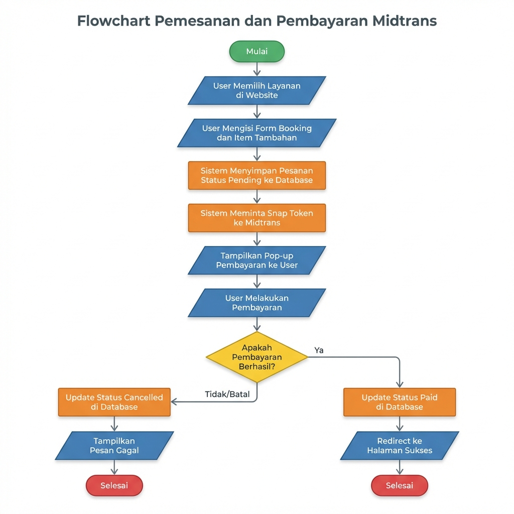
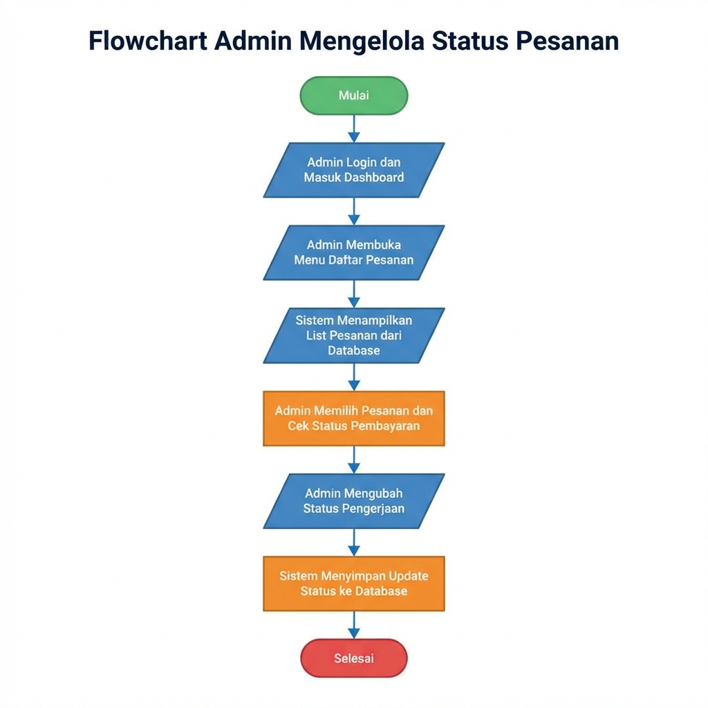
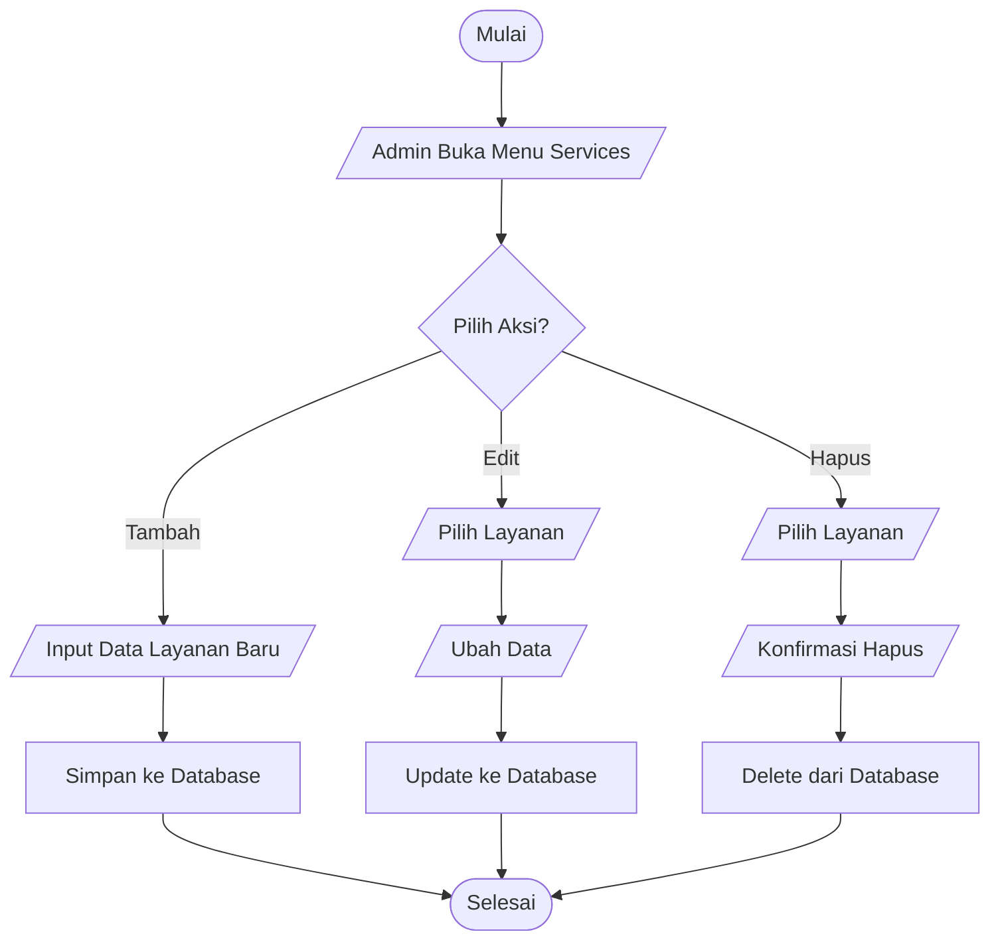
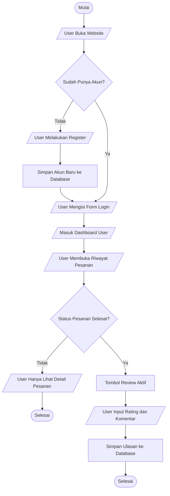

# Dokumentasi Flowchart Sistem Asha Clean

## Daftar Isi
1. [Pendahuluan](#pendahuluan)
2. [Keterangan Simbol](#keterangan-simbol)
3. [Flowchart Pemesanan dan Pembayaran Midtrans](#1-flowchart-pemesanan-dan-pembayaran-midtrans)
4. [Flowchart Admin Mengelola Status Pesanan](#2-flowchart-admin-mengelola-status-pesanan)
5. [Flowchart CRUD Manajemen Layanan](#3-flowchart-crud-manajemen-layanan-oleh-admin)
6. [Flowchart User Login dan Memberi Review](#4-flowchart-alur-user-login-dan-memberi-review)

---

## Pendahuluan

Dokumen ini berisi kumpulan flowchart yang menggambarkan alur proses utama pada sistem **Asha Clean** - sebuah website layanan jasa cleaning service. Flowchart ini dibuat menggunakan standar simbol flowchart untuk memudahkan pemahaman alur sistem.

---

## Keterangan Simbol

| Simbol | Bentuk | Fungsi | Contoh Penggunaan |
|--------|--------|--------|-------------------|
| `([...])` | Oval | Terminal (Start/End) | Mulai, Selesai |
| `[/... /]` | Jajar Genjang | Input/Output Data | User input form, Tampilkan data |
| `[...]` | Persegi Panjang | Proses Sistem | Simpan ke database, Update status |
| `{...}` | Belah Ketupat | Decision/Keputusan | Apakah berhasil?, Sudah login? |

---

## 1. Flowchart Pemesanan dan Pembayaran Midtrans

### Deskripsi
Flowchart ini menggambarkan alur pemesanan layanan oleh user hingga proses pembayaran menggunakan payment gateway Midtrans.

### Gambar Flowchart

### Penjelasan Alur

| No | Langkah | Tipe | Keterangan |
|----|---------|------|------------|
| 1 | Mulai | Terminal | Titik awal proses |
| 2 | User Memilih Layanan di Website | Input | User memilih jenis layanan cleaning yang diinginkan |
| 3 | User Mengisi Form Booking dan Item Tambahan | Input | User mengisi detail pesanan (tanggal, alamat, item tambahan) |
| 4 | Sistem Menyimpan Pesanan Status Pending ke Database | Proses | Pesanan disimpan dengan status "Pending" |
| 5 | Sistem Meminta Snap Token ke Midtrans | Proses | Backend request token pembayaran ke API Midtrans |
| 6 | Tampilkan Pop-up Pembayaran ke User | Output | Menampilkan Snap Payment UI dari Midtrans |
| 7 | User Melakukan Pembayaran | Input | User memilih metode pembayaran dan melakukan pembayaran |
| 8 | Apakah Pembayaran Berhasil? | Decision | Pengecekan status callback dari Midtrans |
| 9a | Ya → Update Status Paid di Database | Proses | Jika berhasil, status diubah ke "Paid" |
| 10a | Redirect ke Halaman Sukses | Output | User diarahkan ke halaman konfirmasi sukses |
| 9b | Tidak/Batal → Update Status Cancelled di Database | Proses | Jika gagal/batal, status diubah ke "Cancelled" |
| 10b | Tampilkan Pesan Gagal | Output | User melihat pesan pembayaran gagal |
| 11 | Selesai | Terminal | Titik akhir proses |

---

## 2. Flowchart Admin Mengelola Status Pesanan

### Deskripsi
Flowchart ini menggambarkan alur admin dalam mengelola dan mengubah status pengerjaan pesanan.

### Gambar Flowchart

### Penjelasan Alur

| No | Langkah | Tipe | Keterangan |
|----|---------|------|------------|
| 1 | Mulai | Terminal | Titik awal proses |
| 2 | Admin Login dan Masuk Dashboard | Input | Admin melakukan autentikasi dan masuk ke panel admin |
| 3 | Admin Membuka Menu Daftar Pesanan | Input | Admin mengakses halaman daftar pesanan |
| 4 | Sistem Menampilkan List Pesanan dari Database | Output | Menampilkan semua pesanan beserta statusnya |
| 5 | Admin Memilih Pesanan dan Cek Status Pembayaran | Proses | Admin memilih pesanan spesifik untuk ditindaklanjuti |
| 6 | Admin Mengubah Status Pengerjaan | Input | Admin mengubah status (Sedang Dikerjakan/Selesai) |
| 7 | Sistem Menyimpan Update Status ke Database | Proses | Perubahan status disimpan ke database |
| 8 | Selesai | Terminal | Titik akhir proses |

---

## 3. Flowchart CRUD Manajemen Layanan oleh Admin

### Deskripsi
Flowchart ini menggambarkan alur admin dalam mengelola data layanan (Create, Read, Update, Delete).

### Kode Mermaid

### Penjelasan Alur

| No | Langkah | Tipe | Keterangan |
|----|---------|------|------------|
| 1 | Mulai | Terminal | Titik awal proses |
| 2 | Admin Buka Menu Services | Input | Admin mengakses halaman manajemen layanan |
| 3 | Pilih Aksi? | Decision | Admin memilih salah satu dari 3 aksi |

**Cabang TAMBAH:**
| No | Langkah | Tipe | Keterangan |
|----|---------|------|------------|
| 4a | Input Data Layanan Baru | Input | Admin mengisi form layanan baru |
| 5a | Simpan ke Database | Proses | Data layanan baru disimpan |

**Cabang EDIT:**
| No | Langkah | Tipe | Keterangan |
|----|---------|------|------------|
| 4b | Pilih Layanan | Input | Admin memilih layanan yang akan diedit |
| 5b | Ubah Data | Input | Admin mengubah data layanan |
| 6b | Update ke Database | Proses | Perubahan disimpan ke database |

**Cabang HAPUS:**
| No | Langkah | Tipe | Keterangan |
|----|---------|------|------------|
| 4c | Pilih Layanan | Input | Admin memilih layanan yang akan dihapus |
| 5c | Konfirmasi Hapus | Input | Sistem meminta konfirmasi penghapusan |
| 6c | Delete dari Database | Proses | Data layanan dihapus dari database |

| No | Langkah | Tipe | Keterangan |
|----|---------|------|------------|
| 7 | Selesai | Terminal | Semua cabang bertemu di titik akhir |

---

## 4. Flowchart Alur User Login dan Memberi Review

### Deskripsi
Flowchart ini menggambarkan alur user dari proses registrasi/login hingga memberikan review pada pesanan yang sudah selesai.

### Kode Mermaid

### Penjelasan Alur

| No | Langkah | Tipe | Keterangan |
|----|---------|------|------------|
| 1 | Mulai | Terminal | Titik awal proses |
| 2 | User Buka Website | Input | User mengakses website Asha Clean |
| 3 | Sudah Punya Akun? | Decision | Pengecekan apakah user sudah terdaftar |

**Cabang TIDAK (Belum Punya Akun):**
| No | Langkah | Tipe | Keterangan |
|----|---------|------|------------|
| 4a | User Melakukan Register | Input | User mengisi form registrasi |
| 5a | Simpan Akun Baru ke Database | Proses | Akun baru disimpan |

**Cabang YA (Sudah Punya Akun) + Lanjutan:**
| No | Langkah | Tipe | Keterangan |
|----|---------|------|------------|
| 6 | User Mengisi Form Login | Input | User memasukkan email dan password |
| 7 | Masuk Dashboard User | Output | User berhasil login dan melihat dashboard |
| 8 | User Membuka Riwayat Pesanan | Input | User mengakses halaman riwayat pesanan |
| 9 | Status Pesanan Selesai? | Decision | Pengecekan status pesanan |

**Jika Status TIDAK Selesai:**
| No | Langkah | Tipe | Keterangan |
|----|---------|------|------------|
| 10a | User Hanya Lihat Detail Pesanan | Output | User tidak bisa memberi review |
| 11a | Selesai | Terminal | Titik akhir proses |

**Jika Status Selesai:**
| No | Langkah | Tipe | Keterangan |
|----|---------|------|------------|
| 10b | Tombol Review Aktif | Proses | Sistem mengaktifkan fitur review |
| 11b | User Input Rating dan Komentar | Input | User memberikan rating dan menulis ulasan |
| 12b | Simpan Ulasan ke Database | Proses | Review disimpan ke database |
| 13b | Selesai | Terminal | Titik akhir proses |

---

## Catatan Teknis

### Teknologi yang Digunakan
- **Backend**: Laravel PHP Framework
- **Payment Gateway**: Midtrans Snap API
- **Database**: MySQL
- **Frontend**: Blade Template Engine + JavaScript

### File Terkait dalam Proyek
- `app/Http/Controllers/PesanController.php` - Controller pemesanan
- `app/Http/Controllers/Admin/OrderController.php` - Controller admin pesanan
- `app/Http/Controllers/ServiceController.php` - Controller layanan
- `app/Http/Controllers/ReviewController.php` - Controller review
- `app/Http/Controllers/Auth/LoginController.php` - Controller autentikasi

---

*Dokumentasi ini dibuat untuk proyek Asha Clean - Website Jasa Cleaning Service*  
*Terakhir diperbarui: Januari 2026*
