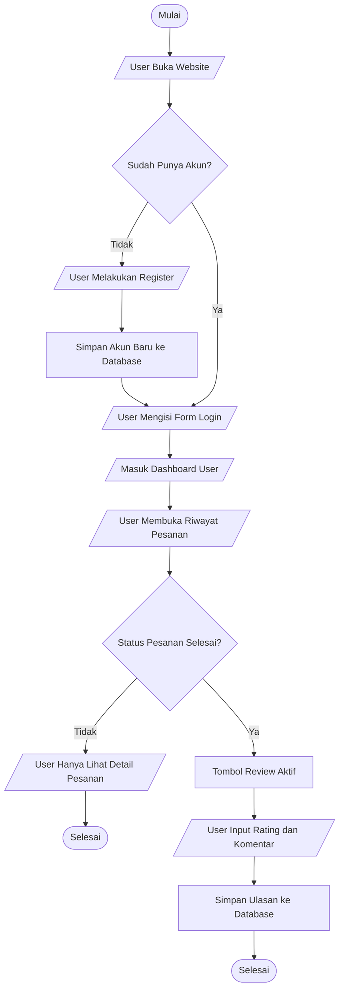

# Flowchart Alur User Login dan Memberi Review

## Keterangan Simbol

| Simbol | Bentuk | Fungsi |
|--------|--------|--------|
| `([...])` | Oval | Start/End |
| `[/... /]` | Jajar Genjang | Input/Output |
| `[...]` | Persegi Panjang | Proses Sistem |
| `{...}` | Belah Ketupat | Decision |

## Cara Render ke Gambar

1. Buka [Mermaid Live Editor](https://mermaid.live/)
2. Copy kode Mermaid di atas
3. Export sebagai PNG/SVG
